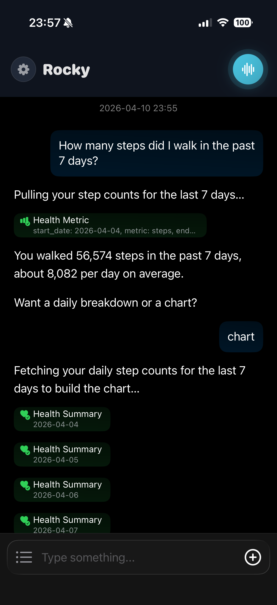
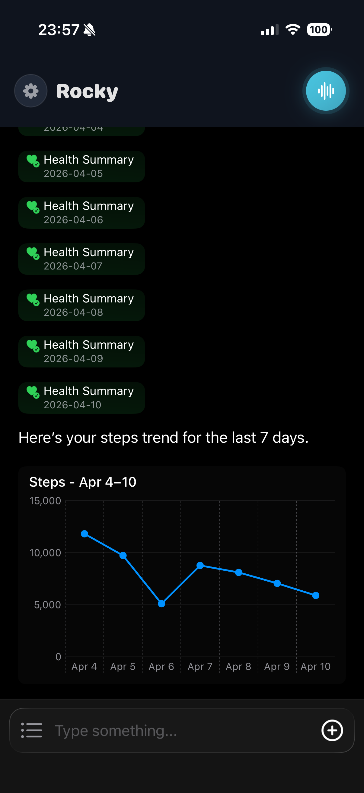
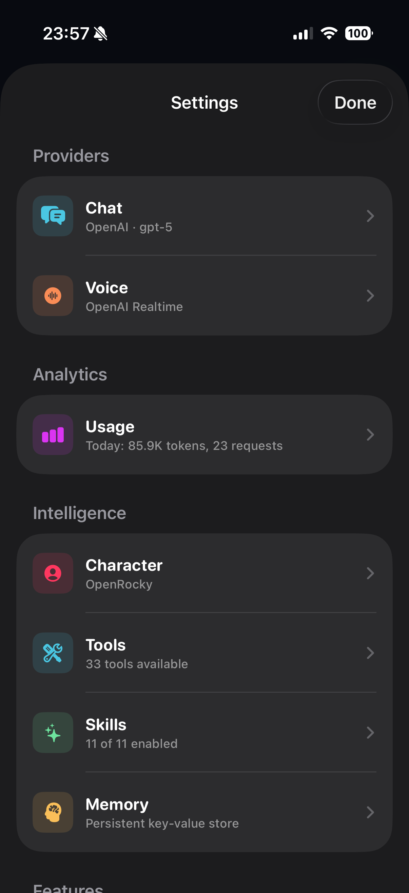
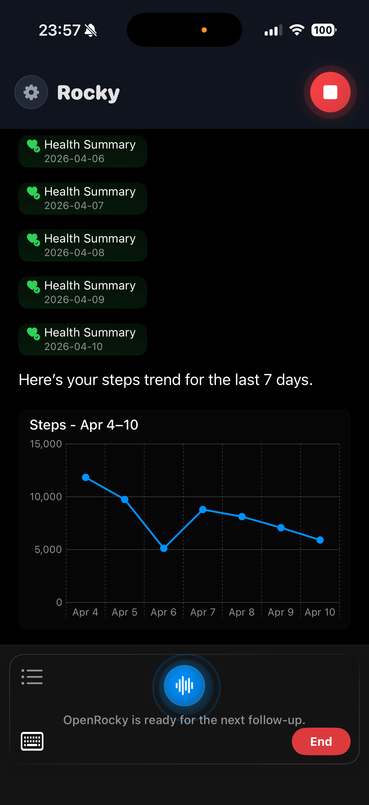

# OpenRocky

[](https://openrocky.org)
[](https://testflight.apple.com/join/GZtbEpXN)
[](https://discord.gg/SvvsaDA4nE)
[](https://t.me/openrocky)
[](LICENSE)

> English | [中文](README_CN.md)

**Rocky** is a voice-first AI Agent app for iPhone. Not a chat wrapper. Not a Linux container crammed into a phone. Rocky organizes voice interaction, task execution, system bridging, and result review into a native iPhone agent experience.

> **Rocky** is the user-facing product name. **OpenRocky** is the open-source project name — like Chrome vs. Chromium.

<p>




</p>

## Features

- **Voice-first** — voice is the primary interface, not a chat list
- **30+ native iOS tools** — contacts, calendar, health, weather, location, reminders, camera, photos, browser, crypto, and more
- **Multi-provider AI** — OpenAI, Anthropic, Gemini, Azure, Groq, xAI, OpenRouter, DeepSeek, Doubao, aiProxy
- **Realtime voice** — live voice sessions via OpenAI, Gemini, and Doubao realtime APIs
- **Custom skills** — built-in skills plus user-importable custom skills
- **Local execution** — controlled shell and Python runtime on-device via `ios_system`
- **Characters & Souls** — configurable AI personality and voice

## Architecture

```
User Voice → Voice Engine → AI Provider → ROS Runtime → Execution Layer → Results → UI + Voice
```

**ROS (Rocky OS) Runtime** is the central execution core:

| Module | Description |
|--------|-------------|
| **Sessions** | Conversation and task contexts with state machine management |
| **Tools** | 30+ iOS native bridge services registered in `OpenRockyToolbox` |
| **Skills** | Built-in and custom importable skills via `OpenRockySkillStore` |
| **Voice** | Realtime voice bridges for OpenAI, Gemini, and Doubao |
| **Characters & Souls** | Personality and voice configuration |
| **Memory** | Persistent context across sessions |

**Three Execution Layers:**

1. **iOS Native Bridge** — Swift code calling system APIs (contacts, calendar, health, etc.)
2. **AI Tool Layer** — actions dispatched through provider APIs
3. **Local Execution** — controlled shell/Python in sandbox via `ios_system`

**Provider Architecture:** Provider → Account → Model (supports 10+ backends)

## Getting Started

### Try Rocky

Download via [TestFlight](https://testflight.apple.com/join/GZtbEpXN) to try the latest beta on your iPhone.

### Build from Source

See **[DEVELOP.md](DEVELOP.md)** for requirements, build instructions, project structure, and deployment details.

## Related Repositories

| Platform | Repository |
|----------|------------|
| iOS | [openrocky/openrocky](https://github.com/openrocky/openrocky) |
| Android | [openrocky/openrocky_android](https://github.com/openrocky/openrocky_android) |

## Community

- **Discord** — [Join server](https://discord.gg/SvvsaDA4nE)
- **Telegram** — [@openrocky](https://t.me/openrocky)
- **X / Twitter** — [@everettjf](https://x.com/everettjf)
- **WeChat** — Scan to follow for updates

  

## Contributing

Found a bug or have a feature request? [Open an issue](https://github.com/openrocky/openrocky/issues/new). See [DEVELOP.md](DEVELOP.md) to set up your development environment.

## Star History

[](https://star-history.com/#openrocky/openrocky&Date)

## License

Apache 2.0 — see [LICENSE](LICENSE) for details.
